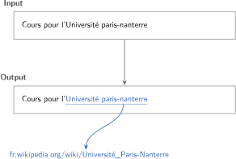
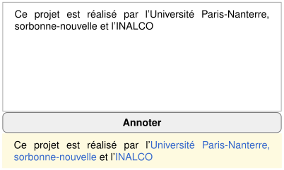

# WikiLink

**WikiLink** est un outil de détection et d'insertion automatique de [liens internes Wikipédia](https://fr.wikipedia.org/wiki/Aide:Liens_internes) (Hyperliens bleus) dans du texte brut français. Il repose sur un modèle de type NER entraîné à reconnaître les segments de texte devant être liés vers un autre article Wikipédia.

## Utilisation

```bash
git clone https://github.com/16arpi/wikilink.git
cd wikilink
pip install -r requirements.txt
```

```bash
fastapi run wikilink
```
L'interface est ensuite accessible depuis [http://localhost:8000](http://localhost:8000).
> Attention : l'inférence s'effectue sur CPU par défaut.

<br>

<p align="center"><strong>Exemple d'utilisation</strong></p>

<br>
<p align="center">
  
</p>


## Sections :

1. [Procédure méthodologique](#procédure-méthodologique)
2. [Corpus d'entraînement](#corpus-dentraînement)
3. [Architecture du modèle NER](#architecture-du-modèle-ner)
4. [Remarques méthodologiques et pistes futures](remarques-méthodologiques-et-pistes-futures)

## Procédure méthodologique

Nous avons suivi quatre étapes :

1. Nettoyage du dump de Wikipédia français (02/2026) en enlevant toutes les balises (XML, wikicode) *sauf* les balises hyperliens `[[…]]`.
2. Constitution du dataset d'entraînement : tokenisation du corpus avec le tokenizer de CamemBERTv2 +  préparation des données (chaque token reçoit une étiquette BIO).
3. Entraînement d'un [perceptron multicouche](https://fr.wikipedia.org/wiki/Perceptron_multicouche) par-dessus les embeddings de CamemBERTv2 pour prédire ces étiquettes BIO.
4. Développement d'une interface web fonctionnant avec FastAPI, où l'utilisateur peut donner du texte brut et obtenir du HTML avec les liens Wikipédia insérés.

## Corpus d'entraînement

Le corpus est construit à partir du dump de Wikipédia français de février 2026 disponible depuis [ce lien](https://dumps.wikimedia.org/frwiki/20260201/). La toute première étape a consisté à retirer toutes les balises (XML, wikicode) à l'exception des balises hyperliens `[[…]]` avec [`FirstDumpCleaning.py`](scripts/FirstDumpCleaning.py). Nous avons ensuite imposé des règles permettant de mettre en œuvre un filtrage léger du corpus avec [`SecondDumpCleaning.py`](scripts/SecondDumpCleaning.py).

La dernière version du corpus nettoyé (2,24 GB) est disponible [à ce lien](https://www.kaggle.com/datasets/gwendaltsang/wikipedia-fr-fevrier2026-presqueparfait), il contient 1,7 millions de lignes de petits textes de wikipédia FR. Bien que ce corpus résulte de plusieurs étapes de nettoyage successives, il n'est pas parfait.

Toutes les données présentes dans les dumps Wikipédia sont sous licence _GNU Free Documentation Licence_ et _Creative Commons Attribution-Share-Alike 4.0 Licence_ (plus d'informations [à cette adresse](https://dumps.wikimedia.org/legal.html)).

### Sous-échantillonnage

Pour des contraintes de temps et de hardware, seule une sous-partie du corpus a été utilisée pour l'entraînement (100 000 segments textuels, dont ~72 000 pour le *train*). Cette sous-partie est disponible dans le fichier [`wikipedia.csv`](data/wikipedia.csv).

### Préparation du jeu de données

Le script [`datasets.py`](scripts/datasets.py) convertit le corpus nettoyé en un jeu de données prêt à l'entraînement. Ce script produit [`dataset.parquet`](data/dataset.parquet) contenant les colonnes suivantes :

| Colonne           | Type                | Description |
|-------------------|---------------------|-------------|
| `text`            | `str`               | Texte original avec les balises `[[…]]` |
| `input`           | `list[int]`         | Les `input_ids` : séquence de tokens encodés par le tokenizer |
| `attention_mask`  | `list[int]`         | Masque d'attention : `1` pour les vrais tokens, `0` pour le padding — permet au modèle d'ignorer les positions de remplissage |
| `offset_mapping`  | `list[tuple[int]]`  | Correspondance entre chaque token et sa position `(début, fin)` dans le texte source — sert à retrouver le texte original à partir des tokens |
| `output`          | `list[int]`         | Étiquettes BIO : `0` (Token hors lien (*Outside*)), `1` (Premier token d'un lien (*Beginning*)), `2` (Token intérieur d'un lien (*Inside*)), ou `-100` (token spécial (CLS, SEP, padding), ignoré par la loss) |

## Architecture du modèle NER

Le modèle NER se compose d'un bloc transformeur-encoder (CamemBERTv2-base) suivi d'un bloc MLP (Perceptron multicouche) :


Nous utilisons [`camembertv2-base`](https://huggingface.co/almanach/camembertv2-base), un modèle RoBERTa pré-entraîné pour le français (~110 M de paramètres).
Ce choix se justifie notamment parce qu'il a été entraîné sur plus de données francophones, dont une version plus récente de Wikipédia que la première version de camemBERT. Ses auteurs ([INRIA/ALMAnaCH](https://almanach.inria.fr/)) rapportent de meilleures performances que la première version de CamemBERT.

Ce modèle a été affiné avec le script [`train.py`](scripts/train.py) qui réentraîne ses deux dernières couches (11 et 12ème couches). Cela permet donc d'adapter les représentations de CamemBERTv2 à cette tâche NER spécifique tout en évitant un entraînement complet, qui serait plus coûteux.

Les embeddings de la dernière couche cachée de CamemBERT sont transmis à un réseau MLP défini avec PyTorch. Le MLP reçoit un vecteur de dimension 768 (taille des embeddings CamemBERTv2-base) pour chaque token de la séquence et produit 3 logits correspondant aux 3 classes BIO.

### Entraînement du modèle

Le modèle de NER a été entraîné pendant [10 epochs](https://github.com/16arpi/wikilink/blob/main/logs/training.txt) avec des batchs de 128 séquences sur un GPU Nvidia L4. Un corpus _dev_ a été isolé pour observer la performance du modèle sur des données inconnues au fur et à mesure de l'entraînement sur le corpus _train_. La _learning rate_ a été fixé à $`10^{-5}`$, le calcul de la loss passe par une mesure de _CrossEntropy_ et l'optimizer choisi est _AdamW_ (dans sa configuration PyTorch par défaut). Différents checkpoints ont été sauvegardés lors de l'entraînement. Celui retenu est celui de l'epoch 8 pour lequel le modèle montre les meilleurs performances (80% d'accuracy).

La tâche d'annotation d'entités nommées est une tâche de classification de tokens aux classes largement déséquilibrées : le nombre de tokens sans entité domine ceux avec entités. Nous avons ainsi appliqué une pondération dans le calcul de la loss pour ne pas pénaliser – entre autres – la classe d'entrée dans une entité nommée (B-LINK). Les valeurs de la pondération ont été calculés à partir de la répartition des classes dans tout le corpus (script `weights.py`).

## Remarques méthodologiques et pistes futures

### Note sur le ratio de liens

Les [guidelines de Wikipédia](https://en.wikipedia.org/wiki/Wikipedia:Manual_of_Style/Linking) recommandent de ne lier que la première occurrence d'un terme dans un article :

> « As a rule of thumb, link only the first occurrence of a term in both the lead and body of the article. »

Cela pourrait entraîner *in fine* une légère sous-annotation par le modèle NER. Nous espérons que la pondération des classes mise en oeuvre dans [`weights.py`](scripts/weights.py) atténue cet éventuel biais.

Il serait possible de stratifier les articles du corpus en fonction de leur densité de liens hypertextes, afin de réduire cet éventuel biais lié à la pratique wikipédienne de ne lier que la première occurrence d'un terme.

### Limites des performances du modèle

Notre programme final donne des résultats intéressants, se rapproche de ce qu'un paragraphe Wikipédia pourrait contenir comme liens. Cependant, en regardant les sorties de notre modèle, on constate différentes difficultés, telles que :

* une mauvaise identification des frontières de mot.
* une mauvaise succession du marqueur B-LINK puis des marqueurs I-LINK.
* parfois, une sûr-annotation d'entités nommées

De telles difficultés pourraient être résolues par le recours à une couche CRF (conditional random fields) qui forcerait le modèle à respecter la structure BIO.

### Mauvaise liaison avec Wikipédia

Notre idée initiale était d'entraîner notre modèle NER, de construire une base de donnée vectorielle avec des embeddings générés à partir des fiches Wikipédia, puis utiliser les embeddings des tokens des entités nommées pour retrouver la fiche Wikipédia associée. Cela s'est avéré trop long et complexe à développer (aussi en terme de mémoire, car il aurait fallu produire des embeddings pour tout Wikipédia...).

Finalement, nous avons trouvé une solution plus simple. Chaque entité nommée identifiée est transformée en lien HTML dont l'URL est la page de recherche de Wikipédia complétée du texte du lien. Dans de nombreux cas, Wikipédia redirige directement vers la fiche Wikipédia de l'entité nommée. Cela rend la liaison très légère.

### Pistes futures

- L'INRIA propose également [`almanach/camembertav2-base`](https://huggingface.co/almanach/camembertav2-base), une variante basée sur l'architecture DeBERTaV2 (au lieu de RoBERTa). Des tests préliminaires suggèrent qu'un MLP entraîné sur ce modèle pourrait offrir de très bonnes performances. Toutefois, DeBERTaV2 est plus coûteux en calcul ce qui augmente le temps d'entraînement et les besoins en mémoire GPU.
- Tester le même modèle mais avec une couche linéaire par dessus afin de comparer les performances MLP _versus_ classifieur linéaire.
- Continuer l'entraînement avec le reste du corpus et voir si les performances peuvent s'améliorer.
- Tester l'utilisation d'une couche CRF pour améliorer le respect de la structure BIO.


### Vrais exemples d'utilisation :


